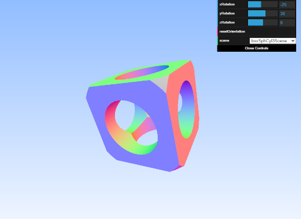

# WebGL CSG Raytracing

*It's still a work in progress...*



## How to run it?
The easiest way if you have **Python 3.x** installed is to use its built-in web server. Run the below command in a terminal or cmd console
```
python -m http.server 5000
````
then open your web browser of choice and enter
```
localhost:5000
```
into the URL bar.
